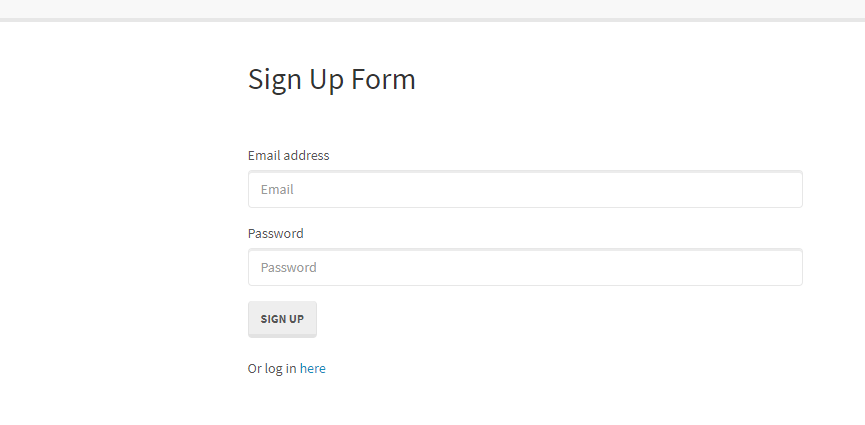
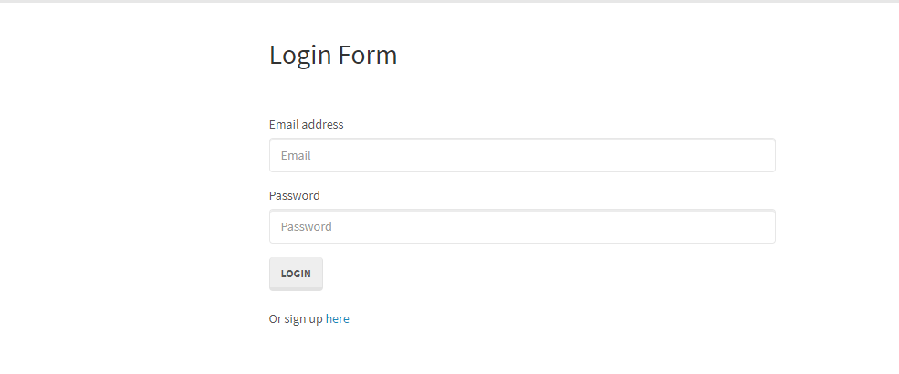
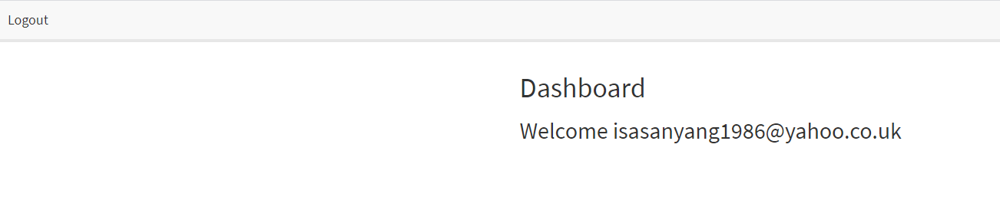

# Reverse-Engineering-Authentication

## Table of contents
- [Screenshots](#screenshots)
- [Description](#description)
- [Installation](#installation)
- [Technologies Used](#technologies-used)
- [Screenshots](#screenshots)
- [Files-Explained](#files-explained)
- [Questions](#questions)

## Description
This project is a walkthrough of a codebase that the user can use to create a new project with NPM, Node, Passport, Sequelize, and MySQLThis project is a walkthrough of a codebase that the user can use to create a new project with NPM, Node, Passport, Sequelize, and MySQL

## Installation

1. Create a MySql db called “passport_demo” and git clone the repo
1.  Go into the config file, open config.js, and insert your personal data ie username, password etc 
1. Open terminal in your current repo and run “npm i” to install all node packages
	Npm install

```
npm packages
Bcryptjs
Express
Express-Session
MySQL2
Passport
Passport-Local
Sequelize

```

## Technologies Used
- CSS
- HTML
- JavaScript
- Node.js
- Workbench

## Screenshots
### Sign Up Form


### Login


### Dashboard



## Files-Explained

# Config
# Middleware
Middleware are functions that handle request, responses and the next middleware in the cycle usually with the signature.
```javascript
  function(req, res, next)
```

isAuthenticated.js {This file indicates whether the current is authenticated (logged in). restricts routes that a user is not allowed to visit if not logged in. }

config.js { Config.js file is where the database connection is set up, this file is dependent on the .env file which stores database credentials. }

passport.js { passport is authentication middleware for Node.js, passpart.js sends a set-Cookie header that will be use to authenticate other pages. }

# Models
index.js {  This file sets the database up and check the connection using Sequelize. Depending on which database you are using, you may need to define a different dialect.}

